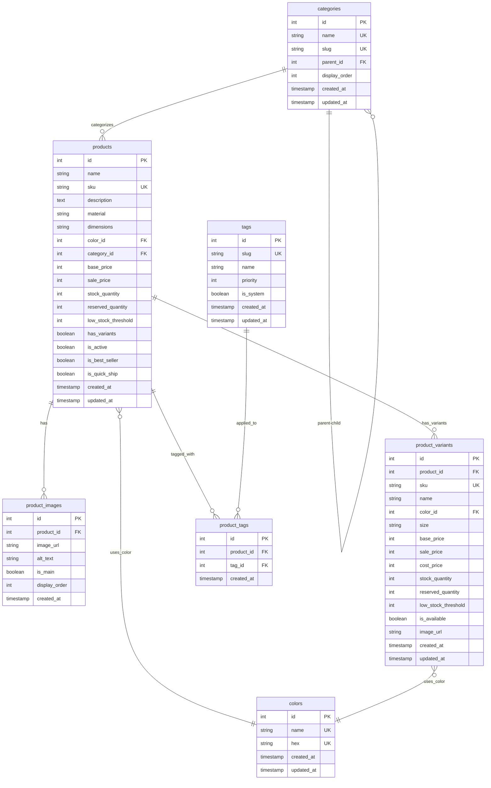

# Database Schema Documentation

## Overview

This document describes the **normalized database schema** for the e‑commerce product management system **after introducing a centralized `colors` master table**.  The design continues to follow Clean Architecture principles while supporting rich product data, including variants, images, categories, colors, and dynamic tagging.

## Entity Relationship Diagram



---

## Table Definitions

### 1. `colors` – Master Color Catalog

Central repository of all colors used across products and variants.  Centralizing color data ensures consistency in naming and HEX values, enables easy colour‑related analytics, and avoids duplication.

| Column       | Type                                 | Description                                        |
| ------------ | ------------------------------------ | -------------------------------------------------- |
| `id`         | INTEGER PK                           | Auto‑incrementing primary key                      |
| `name`       | TEXT NOT NULL UNIQUE                 | Color display name (e.g., "Walnut", "Matte Black") |
| `hex`        | TEXT NOT NULL UNIQUE                 | Hex colour code (e.g., "#8B4513")                  |
| `created_at` | TIMESTAMP DEFAULT CURRENT\_TIMESTAMP | Creation timestamp                                 |
| `updated_at` | TIMESTAMP DEFAULT CURRENT\_TIMESTAMP | Last update timestamp                              |

**Indexes**

* `idx_colors_hex` on `hex`
* `idx_colors_name` on `name`

<hr />

### 2. `products`

Unified product catalogue supporting both simple and complex products.

| Column                | Type                                 | Description                                                        |
| --------------------- | ------------------------------------ | ------------------------------------------------------------------ |
| `id`                  | INTEGER PK                           | Auto‑incrementing primary key                                      |
| `name`                | TEXT NOT NULL                        | Product name (e.g., "Desk", "Coffee Table")                        |
| `sku`                 | TEXT UNIQUE                          | Stock Keeping Unit identifier                                      |
| `description`         | TEXT                                 | Product description                                                |
| `material`            | TEXT                                 | Material composition                                               |
| `dimensions`          | TEXT                                 | Physical dimensions (e.g., "W120×D60×H75cm")                       |
| `color_id`            | INTEGER FK                           | Reference to **colors** table *(used when `has_variants = FALSE`)* |
| `category_id`         | INTEGER FK                           | Reference to **categories** table                                  |
| `base_price`          | INTEGER                              | Base price in yen (used when `has_variants = FALSE`)               |
| `sale_price`          | INTEGER                              | Sale price in yen (used when `has_variants = FALSE`)               |
| `stock_quantity`      | INTEGER DEFAULT 0                    | Total stock (used when `has_variants = FALSE`)                     |
| `reserved_quantity`   | INTEGER DEFAULT 0                    | Reserved stock (used when `has_variants = FALSE`)                  |
| `low_stock_threshold` | INTEGER DEFAULT 5                    | Low‑stock alert threshold                                          |
| `has_variants`        | BOOLEAN DEFAULT FALSE                | Whether product uses variants                                      |
| `is_active`           | BOOLEAN DEFAULT TRUE                 | Product visibility flag                                            |
| `is_best_seller`      | BOOLEAN DEFAULT FALSE                | Best‑seller flag                                                   |
| `is_quick_ship`       | BOOLEAN DEFAULT FALSE                | Quick‑shipping flag                                                |
| `created_at`          | TIMESTAMP DEFAULT CURRENT\_TIMESTAMP | Creation timestamp                                                 |
| `updated_at`          | TIMESTAMP DEFAULT CURRENT\_TIMESTAMP | Last update timestamp                                              |

**Business Rules**

* **Simple products** (`has_variants = FALSE`) manage price, inventory and *color\_id* directly in `products`.
* **Variant products** (`has_variants = TRUE`) must have `color_id IS NULL`; colour is delegated to variants.
* `base_price` is **required** when `has_variants = FALSE`.

**Constraints**

```sql
CONSTRAINT positive_prices        CHECK (base_price IS NULL OR base_price >= 0),
CONSTRAINT positive_stock         CHECK (stock_quantity >= 0),
CONSTRAINT valid_reserved         CHECK (reserved_quantity <= stock_quantity),
CONSTRAINT price_consistency      CHECK (
    (has_variants = FALSE AND base_price IS NOT NULL) OR
    (has_variants = TRUE  AND base_price IS NULL)
),
CONSTRAINT color_consistency      CHECK (
    (has_variants = FALSE AND color_id IS NOT NULL) OR
    (has_variants = TRUE  AND color_id IS NULL)
)
```

**Indexes**

* `idx_products_category_active`   on `(category_id, is_active)`
* `idx_products_has_variants`      on `has_variants`
* `idx_products_color`             on `color_id` WHERE `has_variants = FALSE`
* `idx_products_price_range`       on `(base_price, sale_price)` WHERE `has_variants = FALSE`
* `idx_products_stock`             on `(stock_quantity, reserved_quantity)` WHERE `has_variants = FALSE`
* `idx_products_flags`             on `(is_best_seller, is_quick_ship)` WHERE `is_active = TRUE`

<hr />

### 3. `product_variants`

Optional sellable units with specific attributes.  Used only when `products.has_variants = TRUE`.

| Column                | Type                                 | Description                                       |
| --------------------- | ------------------------------------ | ------------------------------------------------- |
| `id`                  | INTEGER PK                           | Auto‑incrementing primary key                     |
| `product_id`          | INTEGER FK NOT NULL                  | Reference to **products** table                   |
| `sku`                 | TEXT UNIQUE                          | Stock Keeping Unit identifier                     |
| `name`                | TEXT NOT NULL                        | Variant name (e.g., "Standard", "Small – Walnut") |
| `color_id`            | INTEGER FK NOT NULL                  | Reference to **colors** table                     |
| `size`                | TEXT                                 | Size designation (e.g., "S", "M", "120cm")        |
| `base_price`          | INTEGER NOT NULL                     | Variant base price in yen                         |
| `sale_price`          | INTEGER                              | Variant sale price in yen (optional)              |
| `cost_price`          | INTEGER                              | Cost price for margin calculation                 |
| `stock_quantity`      | INTEGER DEFAULT 0                    | Total available stock                             |
| `reserved_quantity`   | INTEGER DEFAULT 0                    | Reserved for pending orders                       |
| `low_stock_threshold` | INTEGER DEFAULT 5                    | Alert threshold                                   |
| `is_available`        | BOOLEAN DEFAULT TRUE                 | Variant availability flag                         |
| `image_url`           | TEXT                                 | Variant‑specific image URL                        |
| `created_at`          | TIMESTAMP DEFAULT CURRENT\_TIMESTAMP | Creation timestamp                                |
| `updated_at`          | TIMESTAMP DEFAULT CURRENT\_TIMESTAMP | Last update timestamp                             |

**Constraints**

```sql
CONSTRAINT positive_variant_prices CHECK (base_price >= 0),
CONSTRAINT positive_variant_stock  CHECK (stock_quantity >= 0),
CONSTRAINT valid_variant_reserved  CHECK (reserved_quantity <= stock_quantity)
```

**Indexes**

* `idx_product_variants_product_id`  on `product_id`
* `idx_product_variants_sku`         on `sku` WHERE `sku IS NOT NULL`
* `idx_product_variants_available`   on `(product_id, is_available)`
* `idx_product_variants_color`       on `color_id`
* `idx_product_variants_price`       on `(base_price, sale_price)`
* `idx_product_variants_stock`       on `(stock_quantity, reserved_quantity)`

<hr />

*The remaining tables (`categories`, `tags`, `product_images`, `product_tags`) are unchanged.  See previous documentation for their full definitions.*

---

## Sample Data

### 1. Insert master colours first

```sql
-- Centralised colour list
INSERT INTO colors (name, hex) VALUES
    ('Walnut',       '#8B4513'),
    ('White Oak',    '#F5F5DC'),
    ('Natural Bamboo','#D2B48C');
```

### 2. Simple Product (no variants)

```sql
-- Bamboo desk organiser without variants
INSERT INTO products (
    name, sku, description, material, dimensions,
    color_id, category_id,
    base_price, sale_price, stock_quantity, has_variants
) VALUES (
    'Desk Organizer', 'DO-BAMBOO-001', 'Minimalist desk organizer', 'Bamboo',
    'W20×D15×H8cm',
    (SELECT id FROM colors WHERE name = 'Natural Bamboo'), 5,
    4500, NULL, 25, FALSE
);
```

### 3. Product with Variants

```sql
-- Parent product
INSERT INTO products (
    name, sku, description, material, category_id, has_variants
) VALUES (
    'Coffee Table', 'CT-ROUND-001', 'Round coffee table', 'Oak wood', 2, TRUE
);

-- Variants (note: colour and size live here)
INSERT INTO product_variants (
    product_id, sku, name, color_id, size, base_price, stock_quantity
) VALUES
((SELECT id FROM products WHERE sku = 'CT-ROUND-001'),
    'CT-WALNUT-SMALL', 'Small – Walnut',
    (SELECT id FROM colors WHERE name = 'Walnut'),
    'Small', 160000, 8),
((SELECT id FROM products WHERE sku = 'CT-ROUND-001'),
    'CT-WALNUT-LARGE', 'Large – Walnut',
    (SELECT id FROM colors WHERE name = 'Walnut'),
    'Large', 180000, 5),
((SELECT id FROM products WHERE sku = 'CT-ROUND-001'),
    'CT-OAK-SMALL', 'Small – White Oak',
    (SELECT id FROM colors WHERE name = 'White Oak'),
    'Small', 160000, 12),
((SELECT id FROM products WHERE sku = 'CT-ROUND-001'),
    'CT-OAK-LARGE', 'Large – White Oak',
    (SELECT id FROM colors WHERE name = 'White Oak'),
    'Large', 180000, 7);
```

---

## Key Business Logic Queries (updated excerpts)

### 1. Unified Product Listing (simple + variants)

```sql
SELECT
    p.id,
    p.name,
    p.description,
    p.has_variants,

    -- Colour (join via colour table or first available variant)
    CASE
        WHEN p.has_variants = FALSE THEN c.name
        ELSE (
            SELECT c2.name FROM product_variants pv2
            JOIN colors c2 ON c2.id = pv2.color_id
            WHERE pv2.product_id = p.id AND pv2.is_available = TRUE
            LIMIT 1
        )
    END       AS primary_color_name,

    CASE
        WHEN p.has_variants = FALSE THEN c.hex
        ELSE (
            SELECT c2.hex FROM product_variants pv2
            JOIN colors c2 ON c2.id = pv2.color_id
            WHERE pv2.product_id = p.id AND pv2.is_available = TRUE
            LIMIT 1
        )
    END       AS primary_color_hex,

    -- Size info
    CASE
        WHEN p.has_variants = FALSE THEN p.dimensions
        ELSE (
            SELECT COUNT(DISTINCT pv.size) FROM product_variants pv
            WHERE pv.product_id = p.id AND pv.is_available = TRUE
        )::TEXT || ' sizes'
    END       AS size_info,

    -- Pricing
    CASE
        WHEN p.has_variants = FALSE THEN p.base_price
        ELSE (
            SELECT MIN(pv.base_price) FROM product_variants pv
            WHERE pv.product_id = p.id AND pv.is_available = TRUE
        )
    END       AS min_price,

    CASE
        WHEN p.has_variants = FALSE THEN p.base_price
        ELSE (
            SELECT MAX(pv.base_price) FROM product_variants pv
            WHERE pv.product_id = p.id AND pv.is_available = TRUE
        )
    END       AS max_price,

    -- Availability
    CASE
        WHEN p.has_variants = FALSE THEN (p.stock_quantity - p.reserved_quantity)
        ELSE (
            SELECT SUM(pv.stock_quantity - pv.reserved_quantity)
            FROM product_variants pv
            WHERE pv.product_id = p.id AND pv.is_available = TRUE
        )
    END AS total_available_stock

FROM products p
LEFT JOIN colors c ON c.id = p.color_id
WHERE p.is_active = TRUE
HAVING total_available_stock > 0
ORDER BY p.is_best_seller DESC, p.name;
```

### 2. Product Detail with Variants

```sql
SELECT
    p.id,
    p.name,
    p.description,
    p.material,
    p.dimensions,
    p.has_variants,

    -- Simple product fields
    p.base_price AS product_base_price,
    p.sale_price AS product_sale_price,
    c.name       AS product_color_name,
    c.hex        AS product_color_hex,
    (p.stock_quantity - p.reserved_quantity) AS product_available_stock,

    -- Variant data (NULL for simple products)
    pv.id            AS variant_id,
    pv.sku           AS variant_sku,
    pv.name          AS variant_name,
    pv.size          AS variant_size,
    pv.base_price    AS variant_base_price,
    pv.sale_price    AS variant_sale_price,
    (pv.stock_quantity - pv.reserved_quantity) AS variant_available_stock,
    c2.name          AS variant_color_name,
    c2.hex           AS variant_color_hex

FROM products p
LEFT JOIN colors c ON c.id = p.color_id
LEFT JOIN product_variants pv        ON pv.product_id = p.id AND pv.is_available = TRUE
LEFT JOIN colors c2                  ON c2.id = pv.color_id
WHERE p.id = ? AND p.is_active = TRUE
ORDER BY c2.name, pv.size;
```

---

## Performance Optimization Strategies

As the e-commerce catalog grows, performance optimization becomes critical. Here are strategies to ensure the database performs well under high load with large datasets.

### Enhanced Indexing Strategies

#### 1. Advanced Composite Indexes

```sql
-- Frequently used search patterns combining category, color and availability
CREATE INDEX idx_products_category_color_active ON products(category_id, color_id, is_active);

-- Price range filtering with availability (common in e-commerce)
CREATE INDEX idx_variants_price_availability ON product_variants(base_price, is_available);

-- Combined stock and availability index
CREATE INDEX idx_variants_stock_availability ON product_variants(stock_quantity, reserved_quantity, is_available);
```

#### 2. Partial Indexes for Active Data

```sql
-- Index only active products (improves performance when most queries filter by is_active)
CREATE INDEX idx_active_products_stock ON products(stock_quantity) 
WHERE is_active = TRUE;

-- Index for available variants with stock
CREATE INDEX idx_available_variants ON product_variants(product_id, color_id) 
WHERE stock_quantity > reserved_quantity AND is_available = TRUE;
```

### Query Optimization Techniques

#### 1. Using Common Table Expressions (CTEs)

Refactoring the unified product listing query with CTEs improves readability and often performance:

```sql
-- Optimize product listing query using CTEs
WITH available_variants AS (
  SELECT 
    product_id,
    MIN(base_price) AS min_price,
    MAX(base_price) AS max_price,
    SUM(stock_quantity - reserved_quantity) AS total_stock,
    COUNT(DISTINCT size) AS size_count,
    MIN(color_id) AS primary_color_id
  FROM product_variants
  WHERE is_available = TRUE
  GROUP BY product_id
)

SELECT
  p.id,
  p.name,
  p.description,
  p.has_variants,
  CASE
    WHEN p.has_variants = FALSE THEN c.name
    ELSE c2.name
  END AS primary_color_name,
  CASE
    WHEN p.has_variants = FALSE THEN c.hex
    ELSE c2.hex
  END AS primary_color_hex,
  CASE
    WHEN p.has_variants = FALSE THEN p.dimensions
    ELSE av.size_count::TEXT || ' sizes'
  END AS size_info,
  CASE
    WHEN p.has_variants = FALSE THEN p.base_price
    ELSE av.min_price
  END AS min_price,
  CASE
    WHEN p.has_variants = FALSE THEN p.base_price
    ELSE av.max_price
  END AS max_price,
  CASE
    WHEN p.has_variants = FALSE THEN (p.stock_quantity - p.reserved_quantity)
    ELSE av.total_stock
  END AS total_available_stock
FROM products p
LEFT JOIN colors c ON c.id = p.color_id
LEFT JOIN available_variants av ON av.product_id = p.id
LEFT JOIN colors c2 ON c2.id = av.primary_color_id
WHERE p.is_active = TRUE
HAVING total_available_stock > 0
ORDER BY p.is_best_seller DESC, p.name;
```

#### 2. Materialized Views for Common Queries

```sql
-- Materialized view for frequently accessed product listing
CREATE MATERIALIZED VIEW product_listing AS
SELECT
  p.id,
  p.name,
  p.description,
  c.name AS category_name,
  CASE
    WHEN p.has_variants = FALSE THEN p.base_price
    ELSE (SELECT MIN(pv.base_price) FROM product_variants pv WHERE pv.product_id = p.id AND pv.is_available = TRUE)
  END AS display_price,
  -- Other commonly needed fields
  p.is_best_seller,
  p.is_quick_ship
FROM products p
JOIN categories c ON c.id = p.category_id
WHERE p.is_active = TRUE;

-- Refresh strategy (can be scheduled)
-- REFRESH MATERIALIZED VIEW product_listing;
```

### Database Partitioning

For very large catalogs (millions of products), consider table partitioning:

```sql
-- Partitioning products by category
CREATE TABLE products (
  -- existing column definitions
) PARTITION BY LIST (category_id);

-- Create partitions for major categories
CREATE TABLE products_category_1 PARTITION OF products
  FOR VALUES IN (1);
CREATE TABLE products_category_2 PARTITION OF products
  FOR VALUES IN (2);
-- Additional category partitions as needed
```

### Monitoring and Maintenance

#### 1. Query Analysis

Regularly analyze slow queries:

```sql
-- Analyze query execution plan
EXPLAIN ANALYZE 
SELECT /* complex query */;
```

#### 2. Index Maintenance

```sql
-- Rebuild indexes periodically
REINDEX TABLE products;
REINDEX TABLE product_variants;
```

#### 3. Database Statistics

```sql
-- Update optimizer statistics
ANALYZE products;
ANALYZE product_variants;
```

These optimization strategies should be implemented incrementally based on actual performance metrics and load testing. Start with the enhanced indexing and query optimization techniques, then consider more advanced strategies like materialized views and partitioning as the catalog grows.
