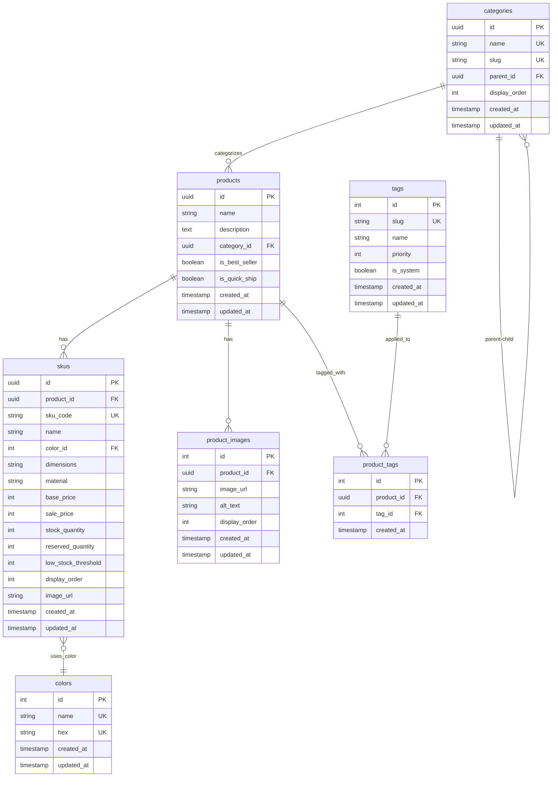

# Database Schema Documentation

## Overview

This document describes the **normalized database schema** for the e‑commerce product management system. The design follows Clean Architecture principles while supporting rich product data, including SKUs, images, categories, colors, and dynamic tagging.

## Entity Relationship Diagram



---

## Table Definitions

### 1. `colors` – Master Color Catalog

Central repository of all colors used across products and SKUs. Centralizing color data ensures consistency in naming and HEX values, enables easy colour‑related analytics, and avoids duplication.

| Column       | Type                                 | Description                                        |
| ------------ | ------------------------------------ | -------------------------------------------------- |
| `id`         | INTEGER PK                           | Auto‑incrementing primary key                      |
| `name`       | TEXT NOT NULL UNIQUE                 | Color display name (e.g., "Walnut", "Matte Black") |
| `hex`        | TEXT NOT NULL UNIQUE                 | Hex colour code (e.g., "#8B4513")                  |
| `created_at` | TIMESTAMP DEFAULT CURRENT\_TIMESTAMP | Creation timestamp                                 |
| `updated_at` | TIMESTAMP DEFAULT CURRENT\_TIMESTAMP | Last update timestamp                              |

**Indexes**

* `idx_colors_hex` on `hex`
* `idx_colors_name` on `name`

<hr />

### 2. `categories` - Product Category Hierarchy

Hierarchical structure for organizing products. Supports multi-level categorization through self-referential parent-child relationships.

| Column          | Type                                   | Description                                      |
| --------------- | -------------------------------------- | ------------------------------------------------ |
| `id`            | UUID PK                                | Primary key                                      |
| `name`          | VARCHAR(255) NOT NULL UNIQUE           | Category display name (e.g., "Furniture")        |
| `slug`          | VARCHAR(255) NOT NULL UNIQUE           | URL-friendly identifier (e.g., "furniture")      |
| `parent_id`     | UUID FK                                | Self-reference for parent category (nullable)     |
| `display_order` | INTEGER NOT NULL DEFAULT 0             | Order for display in menus/navigation            |
| `created_at`    | TIMESTAMPTZ NOT NULL DEFAULT CURRENT_TIMESTAMP | Creation timestamp                      |
| `updated_at`    | TIMESTAMPTZ NOT NULL DEFAULT CURRENT_TIMESTAMP | Last update timestamp                   |

**Indexes**

* `idx_categories_parent` on `parent_id`
* `idx_categories_slug` on `slug`
* `idx_categories_display_order` on `display_order`

**Constraints**

```sql
-- Prevent a category from being its own parent
CONSTRAINT prevent_self_reference CHECK (id != parent_id)
```

**Trigger**

```sql
-- Update timestamp when category is modified
CREATE TRIGGER update_category_timestamp
BEFORE UPDATE ON categories
FOR EACH ROW EXECUTE FUNCTION update_timestamp();
```

<hr />

### 3. `products`

Master product catalog containing basic product information. Detailed product information is stored in the SKUs table.

| Column            | Type                                 | Description                                       |
| ----------------- | ------------------------------------ | ------------------------------------------------- |
| `id`              | UUID PK                              | Primary key                                       |
| `name`            | VARCHAR(255) NOT NULL                | Product name (e.g., "Desk", "Coffee Table")       |
| `description`     | TEXT                                 | Product description                               |
| `category_id`     | UUID NOT NULL FK                     | Reference to **categories** table                 |
| `is_best_seller`  | BOOLEAN NOT NULL DEFAULT FALSE       | Best‑seller flag                                  |
| `is_quick_ship`   | BOOLEAN NOT NULL DEFAULT FALSE       | Quick‑shipping flag                               |
| `created_at`      | TIMESTAMPTZ NOT NULL DEFAULT CURRENT_TIMESTAMP | Creation timestamp                      |
| `updated_at`      | TIMESTAMPTZ NOT NULL DEFAULT CURRENT_TIMESTAMP | Last update timestamp                   |

**Indexes**

* `idx_products_category` on `category_id`
* `idx_products_best_seller` on `is_best_seller` WHERE `is_best_seller = TRUE`

**Note**: Product availability is determined by having at least one SKU with available stock (stock_quantity > reserved_quantity).

<hr />

### 4. `skus`

Stock keeping units that represent sellable items with specific attributes.

| Column                | Type                                   | Description                                       |
| --------------------- | -------------------------------------- | ------------------------------------------------- |
| `id`                  | UUID PK                                | Primary key                                       |
| `product_id`          | UUID NOT NULL FK                       | Reference to **products** table                   |
| `sku_code`            | VARCHAR(50) NOT NULL UNIQUE            | Stock Keeping Unit code                           |
| `name`                | VARCHAR(255) NOT NULL                  | SKU name (e.g., "Standard", "Small – Walnut")     |
| `color_id`            | INTEGER NOT NULL FK                    | Reference to **colors** table                     |
| `dimensions`          | VARCHAR(50)                            | Physical dimensions (e.g., "W120×D60×H75cm")      |
| `material`            | VARCHAR(100)                           | Material composition                              |
| `base_price`          | INTEGER NOT NULL                       | Base price in yen                                 |
| `sale_price`          | INTEGER                                | Sale price in yen (optional)                      |
| `stock_quantity`      | INTEGER NOT NULL DEFAULT 0             | Total available stock                             |
| `reserved_quantity`   | INTEGER NOT NULL DEFAULT 0             | Reserved for pending orders                       |
| `low_stock_threshold` | INTEGER NOT NULL DEFAULT 5             | Alert threshold                                   |
| `display_order`       | INTEGER NOT NULL DEFAULT 0             | Manual display priority (0 = highest priority)    |
| `image_url`           | TEXT                                   | SKU‑specific image URL                            |
| `created_at`          | TIMESTAMPTZ NOT NULL DEFAULT CURRENT_TIMESTAMP | Creation timestamp                       |
| `updated_at`          | TIMESTAMPTZ NOT NULL DEFAULT CURRENT_TIMESTAMP | Last update timestamp                    |

**Constraints**

```sql
CONSTRAINT positive_prices CHECK (base_price >= 0),
CONSTRAINT positive_stock CHECK (stock_quantity >= 0),
CONSTRAINT valid_reserved CHECK (reserved_quantity <= stock_quantity),
CONSTRAINT positive_display_order CHECK (display_order >= 0)
```

**Indexes**

* `idx_skus_product_id` on `product_id`
* `idx_skus_code` on `sku_code`
* `idx_skus_color` on `color_id`
* `idx_skus_dimensions` on `dimensions` WHERE `dimensions IS NOT NULL`
* `idx_skus_material` on `material` WHERE `material IS NOT NULL`
* `idx_skus_stock` on `stock_quantity, reserved_quantity`
* `idx_skus_price` on `base_price, sale_price`
* `idx_skus_display_order` on `(product_id, display_order)`
* `idx_skus_low_stock` on `stock_quantity, reserved_quantity, low_stock_threshold` WHERE `stock_quantity - reserved_quantity <= low_stock_threshold AND stock_quantity - reserved_quantity > 0`

<hr />

### 5. `product_images`

Product images that are associated with a product.

| Column           | Type                                 | Description                          |
| ---------------- | ------------------------------------ | ------------------------------------ |
| `id`             | SERIAL PK                            | Auto-incrementing primary key        |
| `product_id`     | UUID NOT NULL FK                     | Reference to **products** table      |
| `image_url`      | TEXT NOT NULL                        | URL to the image                     |
| `alt_text`       | TEXT                                 | Alternative text for accessibility   |
| `display_order`  | INTEGER NOT NULL DEFAULT 0           | Order of display                     |
| `created_at`     | TIMESTAMPTZ NOT NULL DEFAULT CURRENT_TIMESTAMP | Creation timestamp        |
| `updated_at`     | TIMESTAMPTZ NOT NULL DEFAULT CURRENT_TIMESTAMP | Last update timestamp     |

**Indexes**

* `idx_product_images_product_id` on `product_id`
* `idx_product_images_order` on `(product_id, display_order)`

<hr />

### 6. `product_tags`

Many-to-many relationship between products and tags.

| Column        | Type                                 | Description                     |
| ------------- | ------------------------------------ | ------------------------------- |
| `id`          | SERIAL PK                            | Auto-incrementing primary key   |
| `product_id`  | UUID NOT NULL FK                     | Reference to **products** table |
| `tag_id`      | INTEGER NOT NULL FK                  | Reference to **tags** table     |
| `created_at`  | TIMESTAMPTZ NOT NULL DEFAULT CURRENT_TIMESTAMP | Creation timestamp   |

**Indexes**

* `idx_product_tags_product_id` on `product_id`
* `idx_product_tags_tag_id` on `tag_id`
* `idx_product_tags_unique` UNIQUE on `(product_id, tag_id)`

<hr />

### 7. `tags` - Product Tag System

System for flexible product tagging to support filtering, promotion, and categorization.

| Column       | Type                                   | Description                                     |
| ------------ | -------------------------------------- | ----------------------------------------------- |
| `id`         | INTEGER PK                             | Auto-incrementing primary key                   |
| `slug`       | VARCHAR(50) NOT NULL UNIQUE            | URL-friendly identifier (e.g., "new-arrival")   |
| `name`       | VARCHAR(50) NOT NULL                   | Display name (e.g., "New Arrival")              |
| `priority`   | INTEGER NOT NULL DEFAULT 0             | Tag display/sorting priority                    |
| `is_system`  | BOOLEAN NOT NULL DEFAULT FALSE         | Whether tag is system-generated or manual       |
| `created_at` | TIMESTAMPTZ NOT NULL DEFAULT CURRENT_TIMESTAMP | Creation timestamp                     |
| `updated_at` | TIMESTAMPTZ NOT NULL DEFAULT CURRENT_TIMESTAMP | Last update timestamp                  |

**Indexes**

* `idx_tags_slug` on `slug`
* `idx_tags_priority` on `priority`
* `idx_tags_system` on `is_system` WHERE `is_system = TRUE`

**Trigger**

```sql
CREATE TRIGGER update_tag_timestamp
BEFORE UPDATE ON tags
FOR EACH ROW EXECUTE FUNCTION update_timestamp();
```

---

## Sample Data

### 1. Insert master colours first

```sql
-- Centralised colour list
INSERT INTO colors (name, hex) VALUES
    ('Walnut',       '#8B4513'),
    ('White Oak',    '#F5F5DC'),
    ('Natural Bamboo','#D2B48C');
```

### 2. Simple Product

```sql
-- Create category first (if not exists)
INSERT INTO categories (
    id, name, slug, display_order
) VALUES (
    gen_random_uuid(), 'Storage', 'storage', 5
) ON CONFLICT DO NOTHING
RETURNING id;

-- Save the UUID for referencing
DO $$
DECLARE
    storage_category_id UUID;
BEGIN
    SELECT id INTO storage_category_id FROM categories WHERE slug = 'storage';
    
    -- Create product
    INSERT INTO products (
        id, name, description, category_id, is_best_seller
    ) VALUES (
        gen_random_uuid(), 'Desk Organizer', 'Minimalist desk organizer', storage_category_id, FALSE
    );
END $$;
```

### 3. Product with Multiple SKUs with Display Ordering

```sql
-- Create categories
DO $$
DECLARE
    furniture_category_id UUID;
BEGIN
    -- Insert furniture category
    INSERT INTO categories (
        id, name, slug, display_order
    ) VALUES (
        gen_random_uuid(), 'Furniture', 'furniture', 2
    ) ON CONFLICT DO NOTHING
    RETURNING id INTO furniture_category_id;
    
    -- If didn't insert, get the existing ID
    IF furniture_category_id IS NULL THEN
        SELECT id INTO furniture_category_id FROM categories WHERE slug = 'furniture';
    END IF;
    
    -- Create parent product
    INSERT INTO products (
        id, name, description, category_id, is_best_seller
    ) VALUES (
        gen_random_uuid(), 'Coffee Table', 'Round coffee table', furniture_category_id, TRUE
    );
END $$;

-- Add SKUs with strategic display ordering
DO $$
DECLARE
    product_id UUID;
BEGIN
    SELECT id INTO product_id FROM products WHERE name = 'Coffee Table';
    
    -- SKUs with strategic display ordering (most popular/recommended first)
    INSERT INTO skus (
        id, product_id, sku_code, name,
        color_id, dimensions, material, base_price, stock_quantity, display_order
    ) VALUES
    -- Most popular size/color combination (display_order = 1)
    (gen_random_uuid(),
        product_id,
        'CT-OAK-SMALL', 'Small – White Oak',
        (SELECT id FROM colors WHERE name = 'White Oak'),
        'Diameter: 80cm, Height: 45cm',
        'Solid Oak',
        160000, 12, 1),
    -- Second most popular (display_order = 2)
    (gen_random_uuid(),
        product_id,
        'CT-WALNUT-SMALL', 'Small – Walnut',
        (SELECT id FROM colors WHERE name = 'Walnut'),
        'Diameter: 80cm, Height: 45cm',
        'Solid Walnut',
        160000, 8, 2),
    -- Larger sizes (display_order = 3, 4)
    (gen_random_uuid(),
        product_id,
        'CT-OAK-LARGE', 'Large – White Oak',
        (SELECT id FROM colors WHERE name = 'White Oak'),
        'Diameter: 100cm, Height: 45cm',
        'Solid Oak',
        180000, 7, 3),
    (gen_random_uuid(),
        product_id,
        'CT-WALNUT-LARGE', 'Large – Walnut',
        (SELECT id FROM colors WHERE name = 'Walnut'),
        'Diameter: 100cm, Height: 45cm',
        'Solid Walnut',
        180000, 5, 4);
END $$;
```

---

## Migration Scripts

### Adding display_order to existing SKUs table

```sql
-- Step 1: Add the display_order column
ALTER TABLE skus ADD COLUMN display_order INTEGER NOT NULL DEFAULT 0;

-- Step 2: Add constraint
ALTER TABLE skus ADD CONSTRAINT positive_display_order CHECK (display_order >= 0);

-- Step 3: Create index for performance
CREATE INDEX idx_skus_display_order ON skus (product_id, display_order);

-- Step 4: Set initial display_order values based on business logic
-- (Optional: Set initial values based on price or existing name ordering)
WITH ranked_skus AS (
    SELECT 
        id,
        ROW_NUMBER() OVER (
            PARTITION BY product_id 
            ORDER BY 
                CASE WHEN stock_quantity - reserved_quantity > 0 THEN 0 ELSE 1 END,
                COALESCE(sale_price, base_price) ASC,
                name ASC
        ) as rn
    FROM skus
)
UPDATE skus 
SET display_order = ranked_skus.rn
FROM ranked_skus 
WHERE skus.id = ranked_skus.id;
```

### Rollback Migration (if needed)

```sql
-- Remove the display_order column and related constraints/indexes
DROP INDEX IF EXISTS idx_skus_display_order;
ALTER TABLE skus DROP CONSTRAINT IF EXISTS positive_display_order;
ALTER TABLE skus DROP COLUMN IF EXISTS display_order;
```

## Timestamp Handling

To ensure `updated_at` fields are properly maintained, create a function and triggers:

```sql
-- Timestamp update function
CREATE OR REPLACE FUNCTION update_timestamp()
RETURNS TRIGGER AS $$
BEGIN
    NEW.updated_at = CURRENT_TIMESTAMP;
    RETURN NEW;
END;
$$ LANGUAGE plpgsql;

-- Triggers for each table
CREATE TRIGGER update_product_timestamp
BEFORE UPDATE ON products
FOR EACH ROW EXECUTE FUNCTION update_timestamp();

CREATE TRIGGER update_sku_timestamp
BEFORE UPDATE ON skus
FOR EACH ROW EXECUTE FUNCTION update_timestamp();

CREATE TRIGGER update_product_image_timestamp
BEFORE UPDATE ON product_images
FOR EACH ROW EXECUTE FUNCTION update_timestamp();
```

## Key Business Logic Queries

### 1. Product Listing with Available Stock

```sql
WITH available_skus AS (
  SELECT 
    product_id,
    MIN(base_price) AS min_price,
    MAX(base_price) AS max_price,
    SUM(stock_quantity - reserved_quantity) AS total_stock,
    COUNT(DISTINCT dimensions) AS size_count,
    MIN(color_id) AS primary_color_id
  FROM skus
  WHERE stock_quantity - reserved_quantity > 0
  GROUP BY product_id
)

SELECT
  p.id,
  p.name,
  p.description,
  c.name AS category_name,
  c2.name AS primary_color_name,
  c2.hex AS primary_color_hex,
  CASE
    WHEN av.size_count > 1 THEN av.size_count::TEXT || ' sizes'
    ELSE s.dimensions
  END AS size_info,
  av.min_price,
  av.max_price,
  av.total_stock AS total_available_stock,
  p.is_best_seller,
  p.is_quick_ship
FROM products p
JOIN categories c ON c.id = p.category_id
JOIN available_skus av ON av.product_id = p.id
LEFT JOIN skus s ON s.product_id = p.id AND s.color_id = av.primary_color_id
LEFT JOIN colors c2 ON c2.id = av.primary_color_id
ORDER BY p.is_best_seller DESC, p.name;
```

### 2. Product Detail with SKUs

```sql
SELECT
  p.id,
  p.name,
  p.description,
  c.name AS category_name,
  s.id AS sku_id,
  s.sku_code,
  s.name AS sku_name,
  s.dimensions,
  s.material,
  s.base_price,
  s.sale_price,
  (s.stock_quantity - s.reserved_quantity) AS available_stock,
  c2.name AS color_name,
  c2.hex AS color_hex
FROM products p
JOIN categories c ON c.id = p.category_id
JOIN skus s ON s.product_id = p.id
JOIN colors c2 ON c2.id = s.color_id
WHERE p.id = ?
ORDER BY s.name;
```

### 3. Stock Status Query

```sql
SELECT
  s.id,
  s.sku_code,
  s.name,
  CASE
    WHEN s.stock_quantity - s.reserved_quantity <= 0 THEN 'out_of_stock'
    WHEN s.stock_quantity - s.reserved_quantity <= s.low_stock_threshold THEN 'low_stock'
    ELSE 'in_stock'
  END AS stock_status,
  s.stock_quantity - s.reserved_quantity AS available_quantity
FROM skus s
WHERE s.product_id = ?
ORDER BY s.name;
```

### 4. SKU Display Ordering Strategies

#### **Hybrid Approach (Recommended)**

Combines manual `display_order` with intelligent business logic fallbacks:

```sql
-- Product detail page with optimized SKU ordering
SELECT
  s.id,
  s.sku_code,
  s.name,
  s.dimensions,
  s.material,
  s.base_price,
  s.sale_price,
  (s.stock_quantity - s.reserved_quantity) AS available_stock,
  c.name AS color_name,
  c.hex AS color_hex,
  s.display_order
FROM skus s
JOIN colors c ON c.id = s.color_id
WHERE s.product_id = ?
ORDER BY 
  -- 1. Manual display order (0 = highest priority)
  s.display_order ASC,
  -- 2. Stock availability (in-stock items first)
  CASE WHEN s.stock_quantity - s.reserved_quantity > 0 THEN 0 ELSE 1 END,
  -- 3. Price (lowest first for better conversion)
  COALESCE(s.sale_price, s.base_price) ASC,
  -- 4. Dimensions (consistent size ordering)
  s.dimensions ASC,
  -- 5. Color (consistent color ordering)
  c.name ASC;
```

#### **Smart Default Ordering**

For cases where `display_order` is not set (all SKUs have display_order = 0):

```sql
-- Business logic-based ordering
WITH sku_priority AS (
  SELECT 
    s.*,
    c.name AS color_name,
    c.hex AS color_hex,
    -- Priority scoring
    CASE 
      WHEN s.stock_quantity - s.reserved_quantity <= 0 THEN 3  -- Out of stock (lowest priority)
      WHEN s.stock_quantity - s.reserved_quantity <= s.low_stock_threshold THEN 2  -- Low stock
      ELSE 1  -- In stock (highest priority)
    END AS stock_priority,
    -- Size ordering (extract numeric values for proper sorting)
    CASE 
      WHEN s.dimensions SIMILAR TO '%[0-9]+%' THEN 
        CAST(SUBSTRING(s.dimensions FROM '[0-9]+') AS INTEGER)
      ELSE 999
    END AS size_numeric
  FROM skus s
  JOIN colors c ON c.id = s.color_id
  WHERE s.product_id = ?
)
SELECT 
  id, sku_code, name, dimensions, material, 
  base_price, sale_price, available_stock, 
  color_name, color_hex
FROM sku_priority
ORDER BY 
  stock_priority ASC,           -- In-stock items first
  base_price ASC,              -- Cheaper options first
  size_numeric ASC,            -- Smaller to larger sizes
  color_name ASC;              -- Consistent color ordering
```

#### **Admin Interface Ordering**

For administrative purposes where all SKUs need to be visible:

```sql
-- Admin view with drag-and-drop reordering capability
SELECT
  s.id,
  s.sku_code,
  s.name,
  s.display_order,
  (s.stock_quantity - s.reserved_quantity) AS available_stock,
  c.name AS color_name,
  CASE 
    WHEN s.stock_quantity - s.reserved_quantity <= 0 THEN 'out_of_stock'
    WHEN s.stock_quantity - s.reserved_quantity <= s.low_stock_threshold THEN 'low_stock'
    ELSE 'in_stock'
  END AS stock_status
FROM skus s
JOIN colors c ON c.id = s.color_id
WHERE s.product_id = ?
ORDER BY s.display_order ASC, s.name ASC;
```

---

## Performance Optimization Strategies

### Enhanced Indexing Strategies

```sql
-- Frequently used filtering patterns
CREATE INDEX idx_skus_availability ON skus(product_id, stock_quantity, reserved_quantity);

-- Price range filtering with availability
CREATE INDEX idx_skus_price_availability ON skus(base_price)
WHERE stock_quantity > reserved_quantity;

-- Combined material and color index for filtered searches
CREATE INDEX idx_skus_material_color ON skus(material, color_id)
WHERE stock_quantity > reserved_quantity;
```

### Query Optimization with CTEs

```sql
-- Optimize product search with CTEs
WITH filtered_skus AS (
  SELECT 
    product_id,
    COUNT(*) AS sku_count,
    MIN(base_price) AS min_price,
    SUM(CASE WHEN stock_quantity > reserved_quantity THEN 1 ELSE 0 END) AS available_count
  FROM skus
  WHERE 
    material ILIKE '%oak%' AND
    stock_quantity > reserved_quantity
  GROUP BY product_id
  HAVING SUM(CASE WHEN stock_quantity > reserved_quantity THEN 1 ELSE 0 END) > 0
)
SELECT
  p.id,
  p.name,
  p.description,
  fs.min_price,
  fs.available_count
FROM products p
JOIN filtered_skus fs ON fs.product_id = p.id
ORDER BY p.is_best_seller DESC, p.name;
```

### Materialized Views for Common Queries

```sql
-- Materialized view for product listing with availability
CREATE MATERIALIZED VIEW available_product_listing AS
WITH available_skus AS (
  SELECT 
    product_id,
    MIN(base_price) AS min_price,
    SUM(stock_quantity - reserved_quantity) AS total_stock
  FROM skus
  WHERE stock_quantity > reserved_quantity
  GROUP BY product_id
)
SELECT
  p.id,
  p.name,
  p.description,
  c.name AS category_name,
  av.min_price,
  av.total_stock
FROM products p
JOIN categories c ON c.id = p.category_id
JOIN available_skus av ON av.product_id = p.id
WHERE av.total_stock > 0;

-- Refresh strategy (can be scheduled)
-- REFRESH MATERIALIZED VIEW available_product_listing;
```

These optimization strategies should be implemented incrementally based on actual performance metrics and load testing. Start with the enhanced indexing and query optimization techniques, then consider more advanced strategies like materialized views as the catalog grows.
