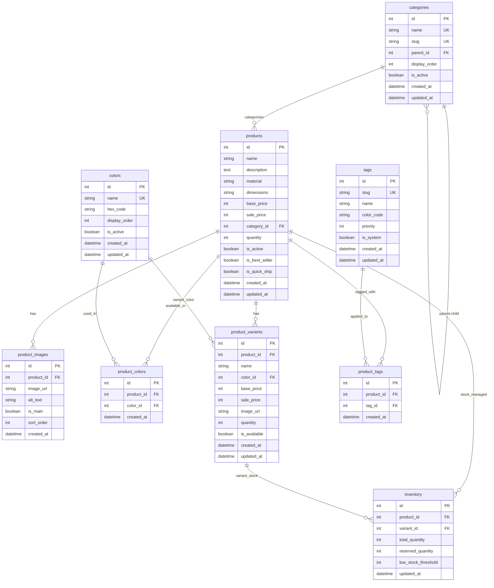

# Database Schema Documentation

## Overview

This document describes the normalized database schema for the e-commerce product management system. The schema follows Clean Architecture principles and supports rich product data including variants, images, categories, colors, and dynamic tagging.

## Entity Relationship Diagram



## Table Descriptions

### Core Tables

#### `products`
Main product entity containing basic product information.

| Column | Type | Description |
|--------|------|-------------|
| `id` | INTEGER PK | Auto-incrementing primary key |
| `name` | TEXT NOT NULL | Product name |
| `description` | TEXT NOT NULL | Product description |
| `material` | TEXT | Material composition |
| `dimensions` | TEXT | Physical dimensions |
| `base_price` | INTEGER NOT NULL | Base price in JPY (smallest unit) |
| `sale_price` | INTEGER | Sale price in JPY (optional) |
| `category_id` | INTEGER FK | Reference to categories table |
| `quantity` | INTEGER DEFAULT 0 | Base quantity (for simple products) |
| `is_active` | BOOLEAN DEFAULT TRUE | Product visibility flag |
| `is_best_seller` | BOOLEAN DEFAULT FALSE | Best seller flag |
| `is_quick_ship` | BOOLEAN DEFAULT FALSE | Quick shipping flag |
| `created_at` | TEXT NOT NULL | Creation timestamp |
| `updated_at` | TEXT NOT NULL | Last update timestamp |

**Indexes:**
- `idx_products_category_id` on `category_id`
- `idx_products_name` on `name`
- `idx_products_is_active` on `is_active`
- `idx_products_flags` on `(is_best_seller, is_quick_ship)`

#### `categories`
Hierarchical product categorization system.

| Column | Type | Description |
|--------|------|-------------|
| `id` | INTEGER PK | Auto-incrementing primary key |
| `name` | TEXT NOT NULL UNIQUE | Category display name |
| `slug` | TEXT NOT NULL UNIQUE | URL-friendly identifier |
| `parent_id` | INTEGER FK | Self-reference for hierarchy |
| `display_order` | INTEGER DEFAULT 0 | Sort order |
| `is_active` | BOOLEAN DEFAULT TRUE | Category visibility |
| `created_at` | TEXT NOT NULL | Creation timestamp |
| `updated_at` | TEXT NOT NULL | Last update timestamp |

**Indexes:**
- `idx_categories_parent_id` on `parent_id`
- `idx_categories_slug` on `slug`

#### `colors`
Color definitions for products and variants.

| Column | Type | Description |
|--------|------|-------------|
| `id` | INTEGER PK | Auto-incrementing primary key |
| `name` | TEXT NOT NULL UNIQUE | Color name (e.g., "Walnut", "Black Oak") |
| `hex_code` | TEXT | Hex color code for UI display |
| `display_order` | INTEGER DEFAULT 0 | Sort order |
| `is_active` | BOOLEAN DEFAULT TRUE | Color availability |
| `created_at` | TEXT NOT NULL | Creation timestamp |
| `updated_at` | TEXT NOT NULL | Last update timestamp |

**Indexes:**
- `idx_colors_name` on `name`

#### `tags`
Dynamic tagging system for product flags and labels.

| Column | Type | Description |
|--------|------|-------------|
| `id` | INTEGER PK | Auto-incrementing primary key |
| `slug` | TEXT NOT NULL UNIQUE | Unique identifier (e.g., "on_sale") |
| `name` | TEXT NOT NULL | Display name (e.g., "On Sale") |
| `color_code` | TEXT DEFAULT '#666666' | Tag color for UI |
| `priority` | INTEGER DEFAULT 0 | Display priority (lower = higher priority) |
| `is_system` | BOOLEAN DEFAULT FALSE | System-managed tag flag |
| `created_at` | TEXT NOT NULL | Creation timestamp |
| `updated_at` | TEXT NOT NULL | Last update timestamp |

**System Tags:**
- `on_sale` (priority: 1) - Products with sale pricing
- `best_seller` (priority: 2) - Popular products
- `quick_ship` (priority: 3) - Fast shipping available
- `new_arrival` (priority: 4) - Recently added products
- `sold_out` (priority: 5) - Out of stock products

### Relationship Tables

#### `product_images`
Multiple images per product with ordering and main image designation.

| Column | Type | Description |
|--------|------|-------------|
| `id` | INTEGER PK | Auto-incrementing primary key |
| `product_id` | INTEGER FK NOT NULL | Reference to products table |
| `image_url` | TEXT NOT NULL | Image URL or path |
| `alt_text` | TEXT | Accessibility text |
| `is_main` | BOOLEAN DEFAULT FALSE | Main product image flag |
| `sort_order` | INTEGER DEFAULT 0 | Display order |
| `created_at` | TEXT NOT NULL | Creation timestamp |

**Indexes:**
- `idx_product_images_product_id` on `product_id`

#### `product_colors`
Many-to-many relationship between products and available colors.

| Column | Type | Description |
|--------|------|-------------|
| `id` | INTEGER PK | Auto-incrementing primary key |
| `product_id` | INTEGER FK NOT NULL | Reference to products table |
| `color_id` | INTEGER FK NOT NULL | Reference to colors table |
| `created_at` | TEXT NOT NULL | Creation timestamp |

**Constraints:**
- `UNIQUE(product_id, color_id)` - Prevent duplicate color assignments

#### `product_variants`
Product variations with specific colors and pricing.

| Column | Type | Description |
|--------|------|-------------|
| `id` | INTEGER PK | Auto-incrementing primary key |
| `product_id` | INTEGER FK NOT NULL | Reference to products table |
| `name` | TEXT NOT NULL | Variant name (e.g., "Small", "Large") |
| `color_id` | INTEGER FK NOT NULL | Reference to colors table |
| `base_price` | INTEGER NOT NULL | Variant base price in JPY |
| `sale_price` | INTEGER | Variant sale price in JPY |
| `image_url` | TEXT | Variant-specific image |
| `quantity` | INTEGER DEFAULT 0 | Variant-specific quantity |
| `is_available` | BOOLEAN DEFAULT TRUE | Variant availability |
| `created_at` | TEXT NOT NULL | Creation timestamp |
| `updated_at` | TEXT NOT NULL | Last update timestamp |

#### `product_tags`
Many-to-many relationship between products and tags.

| Column | Type | Description |
|--------|------|-------------|
| `id` | INTEGER PK | Auto-incrementing primary key |
| `product_id` | INTEGER FK NOT NULL | Reference to products table |
| `tag_id` | INTEGER FK NOT NULL | Reference to tags table |
| `created_at` | TEXT NOT NULL | Creation timestamp |

**Constraints:**
- `UNIQUE(product_id, tag_id)` - Prevent duplicate tag assignments

#### `inventory`
Stock management for products and variants.

| Column | Type | Description |
|--------|------|-------------|
| `id` | INTEGER PK | Auto-incrementing primary key |
| `product_id` | INTEGER FK | Reference to products table |
| `variant_id` | INTEGER FK | Reference to product_variants table |
| `total_quantity` | INTEGER DEFAULT 0 | Total available stock |
| `reserved_quantity` | INTEGER DEFAULT 0 | Reserved for pending orders |
| `low_stock_threshold` | INTEGER DEFAULT 10 | Alert threshold |
| `updated_at` | TEXT NOT NULL | Last update timestamp |

**Constraints:**
- `CHECK((product_id IS NOT NULL AND variant_id IS NULL) OR (product_id IS NULL AND variant_id IS NOT NULL))` - Either product or variant, not both
- `CHECK(reserved_quantity <= total_quantity)` - Reserved cannot exceed total
- `CHECK(total_quantity >= 0)` - Non-negative quantities
- `CHECK(reserved_quantity >= 0)` - Non-negative reservations

**Calculated Fields:**
- Available Quantity = `total_quantity - reserved_quantity`

## Data Examples

### Sample Categories
```
desks, tables, seating, bench-consoles, accessories,
monitor-risers, wall-shelves, side-tables, lighting,
bike-racks, audio
```

### Sample Colors
```
Walnut (#8B4513), White Oak (#F5F5DC), Black Oak (#2F2F2F),
Whitewash Oak (#F8F8FF), Black (#000000), White (#FFFFFF),
Charcoal (#36454F), Mist (#C4C4C4), Smoke (#738276),
Sand (#C2B280), Gray (#808080), Brass (#B5A642), Beige (#F5F5DC)
```

### Sample Products
```
- Desk - Walnut: ¥343,500 → ¥268,500 (On Sale + Best Seller)
- Coffee Table - Walnut: ¥180,000 (Best Seller)
- Pendant Light - Brass: ¥36,000 (Quick Ship)
- Table - Black Oak: ¥420,000 (Sold Out)
```

## Migration History

1. **Phase 1**: Basic products table with simple structure
2. **Phase 2**: Normalized schema with categories, colors, tags, variants
3. **Phase 2.1**: Unified products table, removed products_v2, integrated mockData

## Performance Considerations

### Indexes
- All foreign keys are indexed for join performance
- Product name and category searches are optimized
- Flag-based queries (best_seller, quick_ship) are indexed

### Query Patterns
- Product listing with category filtering
- Color-based product searches
- Tag-based filtering (on sale, best sellers, etc.)
- Inventory availability checks
- Image loading with main image priority

## Future Enhancements

- **Reviews & Ratings**: Customer feedback system
- **Pricing History**: Track price changes over time
- **Bulk Operations**: Batch inventory updates
- **Search Optimization**: Full-text search capabilities
- **Audit Trail**: Change tracking for products and inventory 